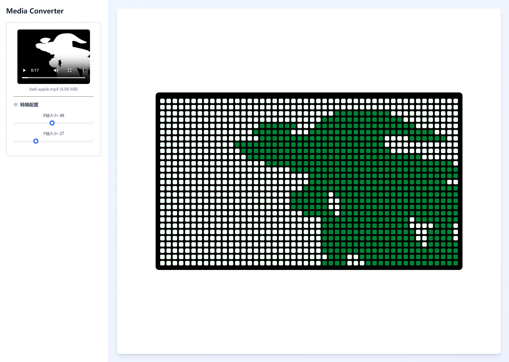
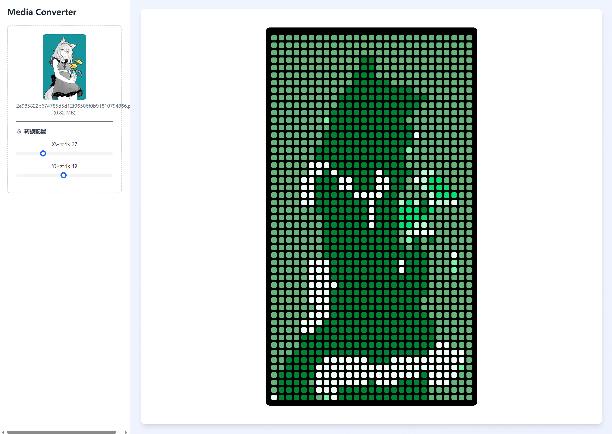

# 像素矩阵播放器 | Pixel Matrix Player

一个基于Web前端的工具，用于将图片和视频转换成像素点阵并播放，支持8色压缩。效果类似于GitHub贡献活动图的风格。

## ✨ 特点

- 🖼️ **纯前端处理**：所有图像和视频转换完全在浏览器中进行，无需服务器
- 🎨 **8色压缩**：将图像和视频颜色压缩至8色 (3位色彩)
- 📊 **像素点阵化**：将媒体转换为可自定义大小的点阵显示
- 🎬 **支持图片和视频**：同时支持静态图片和动态视频的点阵化处理
- 🎭 **多种主题**：提供多种显示主题，如绿色、紫色等，类似GitHub贡献图风格
- 📱 **响应式设计**：适配不同屏幕尺寸

## 📸 效果展示

<details>

<summary> 这里将展示一些使用本工具处理后的效果示例。您可以通过上传自己的图片和视频来体验实际效果。</summary>






</details>


## 🚀 快速开始

### 在线使用

访问我们的[在线演示(备案中)](http://pixel-matrix-player.yefu24324.com) -> [备用链接](http://43.139.15.54:22011)

### 本地运行

1. 克隆此仓库
```bash
git clone https://github.com/yefu24324/pixel-matrix-player.git
cd pixel-matrix-player
```

2. 安装依赖
```bash
pnpm install
```

3. 启动开发服务器
```bash
pnpm dev
```

4. 打开浏览器访问 `http://localhost:3000`

### 构建与部署

1. 构建项目
```bash
pnpm build
```

2. 运行生产服务器
```bash
pnpm serve
```

## 📖 使用方法

1. 上传图片或视频文件（支持拖放操作）
2. 通过滑块调整X轴和Y轴的点阵大小
3. 观看转换后的像素点阵效果
4. 可使用示例文件（如Bad Apple.mp4）来体验效果

## 🔧 技术栈

- [SolidJS](https://www.solidjs.com/) - 高性能的前端框架
- [Vite](https://vitejs.dev/) - 下一代前端构建工具
- [TypeScript](https://www.typescriptlang.org/) - JavaScript的超集语言
- [Tailwind CSS](https://tailwindcss.com/) - 实用的CSS框架

## 🧩 项目结构

```
src/
├── components/
│   ├── pixel-matrix-player/ - 像素矩阵播放器核心组件
│   ├── slider/ - 滑块控制组件
│   └── layout/ - 布局组件
├── app.tsx - 主应用程序
└── index.tsx - 入口文件
```

## 🔍 工作原理

1. **图像/视频获取**：从用户上传或提供的URL获取媒体
2. **缩放处理**：将图像/视频缩放至指定的点阵大小
3. **颜色量化**：使用最近颜色算法将每个像素量化为8种预定义颜色之一
4. **点阵渲染**：将量化后的数据以点阵形式渲染，应用指定主题

## 👨‍💻 作者

- 夜浮卿 (yefu) - [GitHub](https://github.com/yefu24324)

[//]: # (## 🤝 贡献)


## 📝 计划
- 使用ffmpeg或WebAV来处理视频文件
- 支持更多的颜色主题
- 优化颜色量化算法
- 自动调整点阵大小以适应媒体尺寸
- 添加更多的自定义选项
- 支持自定义颜色主题
- 导出点阵化后的数据JSON与图片和视频
- 允许直接运行示例文件

[//]: # (## 📄 许可证)
